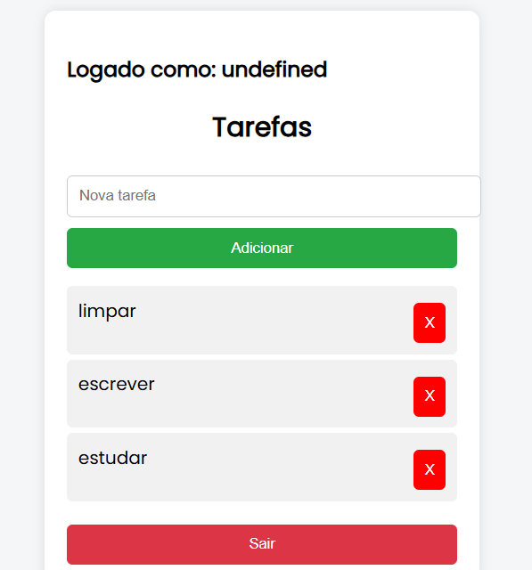

# 🧾 Sistema de Gerenciamento de Tarefas

Aplicação full stack para gerenciamento de tarefas com autenticação JWT, desenvolvida com Flask no backend e JavaScript puro no frontend.

---

## 🚀 Funcionalidades

* 🔐 Cadastro e login de usuários
* 🔑 Autenticação com JWT
* ➕ Criar tarefas
* 📋 Listar tarefas
* ✏️ Editar tarefas
* ❌ Deletar tarefas
* 💾 Persistência em banco de dados (SQLite)
* 🔄 Sessão persistente com localStorage

---

## 🛠️ Tecnologias utilizadas

* Python (Flask)
* Flask-JWT-Extended
* Flask-SQLAlchemy
* SQLite
* HTML + JavaScript

---

## ▶️ Como rodar o projeto

### 🔹 1. Clonar repositório

```bash
git clone https://github.com/MartinHenschel/api-tasks.git
cd api-tasks
```

### 🔹 2. Criar ambiente virtual

```bash
python -m venv venv
venv\Scripts\activate
```

### 🔹 3. Instalar dependências

```bash
pip install flask flask_sqlalchemy flask_jwt_extended flask-cors
```

### 🔹 4. Rodar a aplicação

```bash
python app.py
```

---

## 🌐 Rodar o front-end

Abra o arquivo `index.html` no navegador
ou rode:

```bash
python -m http.server
```

Acesse:

```
http://localhost:8000
```

---

## 🔐 Autenticação

A API utiliza JWT para proteger rotas.
Após o login, o token é armazenado no navegador e enviado nas requisições.

---

## 📌 Endpoints principais

| Método | Rota       | Descrição        |
| ------ | ---------- | ---------------- |
| POST   | /register  | Criar usuário    |
| POST   | /login     | Login            |
| GET    | /tasks     | Listar tarefas   |
| POST   | /tasks     | Criar tarefa     |
| PUT    | /tasks/:id | Atualizar tarefa |
| DELETE | /tasks/:id | Deletar tarefa   |

---

## 📷 Demonstração

*(adicione aqui um print do sistema depois)*

---

## 💡 Melhorias futuras

* Interface mais moderna (CSS)
* Deploy em nuvem
* Refresh token
* Criptografia de senha

---


